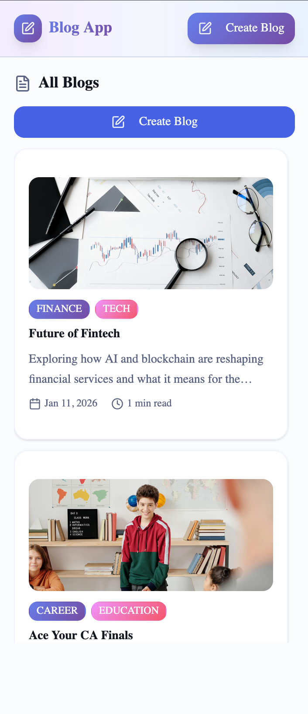
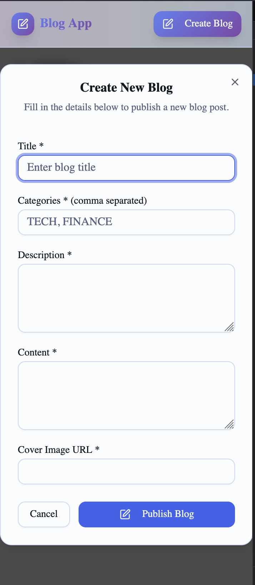
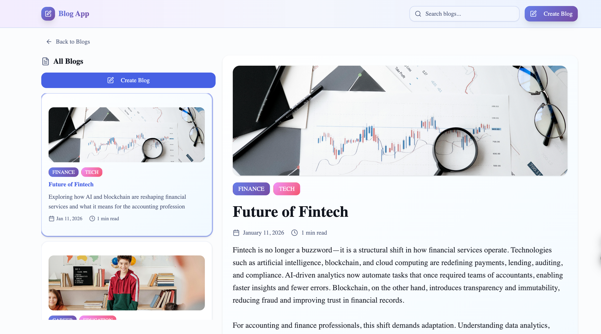
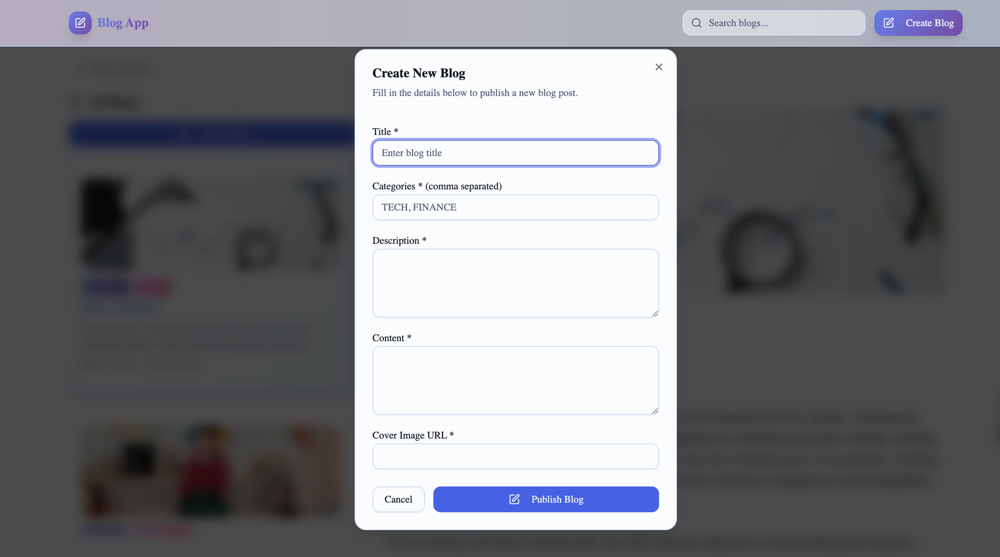

# CA Monk - Blog Application Assignment

Welcome to the CA Monk Blog Application assignment! This project tests your ability to build a modern React application with state management, styling, and component libraries.

# 📝 Blog Application

A modern, clean, and fully responsive **Blog Application** built using **React, TypeScript, TanStack Query, Tailwind CSS, and shadcn/ui**.

This project was developed as part of a frontend internship assignment to demonstrate real-world React development, API handling, and modern UI design practices.

---

## 🚀 Live Preview (Local)

- Frontend: http://localhost:5173  
- Backend (JSON Server): http://localhost:3001  

---

## 📸 Project Preview

### 📱 Mobile View
  

---

### 💻 Desktop View

> UI is inspired by the provided reference design but implemented with a custom layout and styling.

---

## ✨ Features

- 📄 View all blog posts in a clean card layout
- 🔍 Search blogs instantly
- 📘 View full blog details with image and content
- ➕ Create new blog using modal dialog
- 🔄 Automatic UI update after blog creation
- ⚡ Fast data fetching with TanStack Query
- ❌ Proper loading and error handling
- 🎨 Modern UI with Tailwind CSS & shadcn/ui
- 📱 Fully responsive (mobile + desktop)
- 🧩 Clean and reusable component structure

---

## 🛠️ Tech Stack

- **React (Vite)**
- **TypeScript**
- **TanStack Query**
- **Tailwind CSS**
- **shadcn/ui**
- **JSON Server (Mock Backend)**

---

## 📂 Project Structure

Good luck! 🚀
